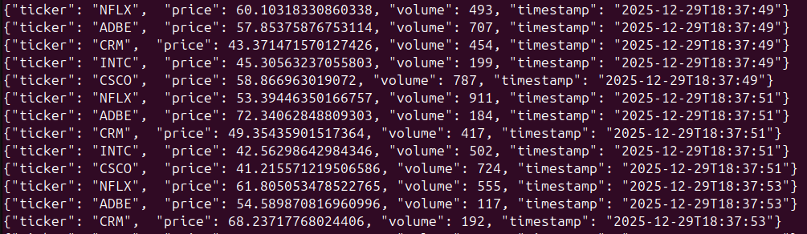

# module-2 стримминг котировок

## Серверная часть
Многопоточный сервер для обработки запросов на получение котировок акций TCP/UDP (udp для стримминга).
Запуск сервера:
quote-server <server_addr> <udp-port> <ticker-file> <log-level> <log-file>

<server_addr> - адрес и порт на прослушивание данных 
<udp-port> - udp порт для обмена по протоколу UDP
<ticker-file>  - файл котировок (с разделителем "\n") для генерации котировок
<log-level> - уровень логирования (info, debug, warn, error)
<log-file> - файл для логирования (по умолчанию qute-server.log)

Пример запуска сервера:
quote-server -s 127.0.0.1:8210 -u 55505 -t tickers.txt -l info

## Клиентская часть
Клиент для запроса котировок акций.
Запуск клиента:
Многопоточный клиент, поддерживает отправление данных PING для контроля работы со стороны сервера
quote-client <server_addr <udp-port> <ticker-file> <log-level> <log-file>

Пример запуска сервера:
quote-server 127.0.0.1:8210 55500 tickers.txt info
<server_addr> - адрес и порт сервера котировок
<udp-port> - udp порт для обмена по протоколу UDP
<ticker-file>  - файл запроса котировок (с разделителем "\n")
<log-level> - уровень логирования (info, debug, warn, error)
<log-file> - файл для логирования (по умолчанию qute-client.log)

Логирование отравляется в файл: quote-client.log

## Пример вывода данных:

## Файлы tickers:
- tickers.txt - файл котировок для сервера
- tickers_request.txt - файл котировок для запроса клиентом
- tickers_request_1.txt - файл котировок для запроса клиентом

